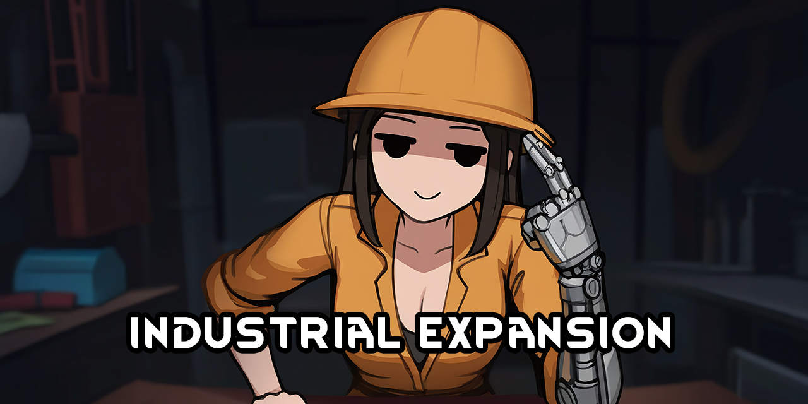

<!--[![GPLv3][badge-license]](https://www.gnu.org/licenses/gpl-3.0) -->
[badge-license]: https://img.shields.io/badge/License-GPLv3-lightgray
<!--![Supports Royalty][badge-dlc-royalty] supports Royalty DLC-->
[badge-dlc-royalty]: https://img.shields.io/badge/DLC-Royalty-gold
<!--![Supports Ideology][badge-dlc-ideology] supports Ideology DLC-->
[badge-dlc-ideology]: https://img.shields.io/badge/DLC-Ideology-indianred
<!--![Supports Biotech][badge-dlc-biotech] supports Biotech DLC-->
[badge-dlc-biotech]: https://img.shields.io/badge/DLC-Biotech-mediumturquoise
<!--![Supports Anomaly][badge-dlc-anomaly] supports Anomaly DLC-->
[badge-dlc-anomaly]: https://img.shields.io/badge/DLC-Anomaly-darkseagreen

# industrial expansion

[![GPLv3][badge-license]](https://www.gnu.org/licenses/gpl-3.0)

Scope of this mod:
- Rebalance the acquisition and use of industrial materials such as components and cloth

> [!IMPORTANT]
> Requires [Vanilla Expanded Framework](https://steamcommunity.com/sharedfiles/filedetails/?id=2023507013).

## Changes
### Components
- Craftable at the machining table with a 20% increased work requirement compared to fabrication
### Metal
- [Simple Chains: Steel](https://steamcommunity.com/sharedfiles/filedetails/?id=1702668415) (iron and coal prerequisites for steel) updated for 1.5
### Neutroamine
- ~~Can now be synthesized in an expensive three step process~~ (WIP)
### Textiles
- Cotton and devilstrand plants now yield raw fiber that must be spun before it can be used for crafting
- ~~[Simple Chains: Leather](https://steamcommunity.com/workshop/filedetails/?id=1713884017) (leather rework with tanning requirement) updated for 1.5, using Vanilla Expanded Framework~~ (WIP)
### Wood
- [Simple Chains: Lumber](https://steamcommunity.com/sharedfiles/filedetails/?id=1708709952) (wood expansion with lumber drying) updated for 1.5, using Vanilla Expanded Framework

### To-do:
- [x] Industrial component crafting
- [x] Spinning wheel and fiber rework
- [ ] Electric wheel
- [x] Implement and update [Simple Chains: Lumber](https://steamcommunity.com/sharedfiles/filedetails/?id=1708709952) for 1.5
- [ ] Balance test lumber
- [x] Implement and update [Simple Chains: Steel](https://steamcommunity.com/sharedfiles/filedetails/?id=1702668415) for 1.5
- [ ] Balance test steel
- [ ] Implement and update [Simple Chains: Leather](https://steamcommunity.com/workshop/filedetails/?id=1713884017) for 1.5
- [ ] Balance test leather
- [ ] Neutroamine synthesis (see [doc](neutroamine.md))

# Legal
Portions of the materials used to create this mod are trademarks and/or copyrighted works of Ludeon Studios Inc. All rights reserved by Ludeon. This mod is not official and is not endorsed by Ludeon.

This mod includes code and textures from [Simple Chains: Lumber](https://github.com/Owlchemist/simple-chains-lumber) and [Simple Chains: Steel](https://github.com/Owlchemist/simple-chains-steel) by Owlchemist, modified by boomer, used under the GPL-3.0 License.